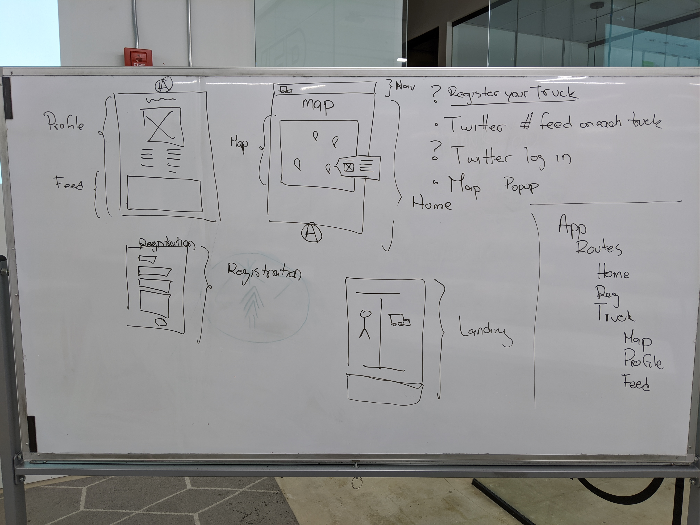
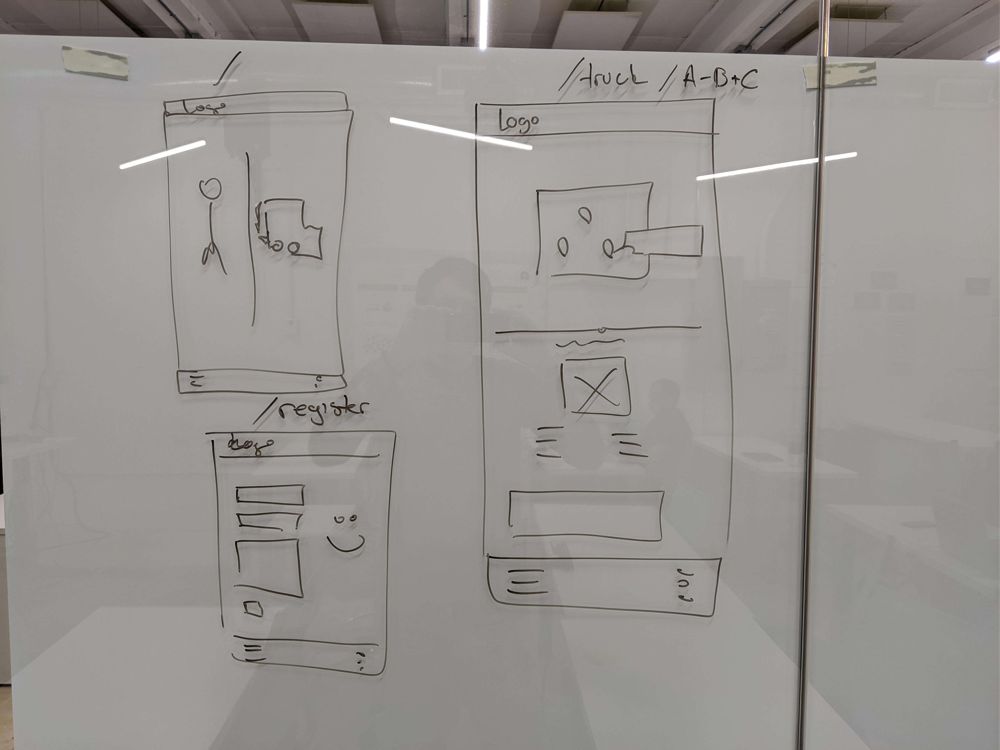

# Food Truck Locator

This app caters two types of users. Food truck owners and food truck enthusiasts.
Food truck owners are able to sign up by adding their truck information.
Also they will be able to login when active to show their location on a map.
Foot truck enthusiasts can open the app to see a map center on their location and then they can search to see if there's any active food truck nearby.

## Wireframes

## Running the App

In the root directory of the project...

1. Install node modules `yarn install` or `npm install`.
2. Start development server `yarn start` or `npm start`.

